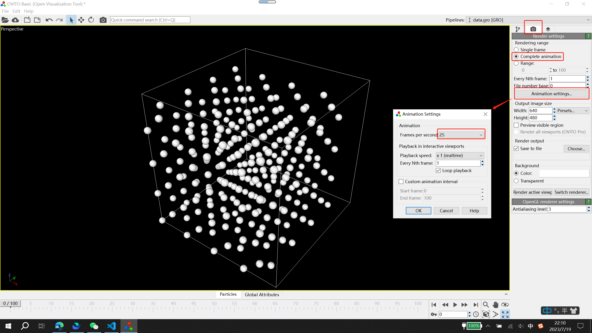
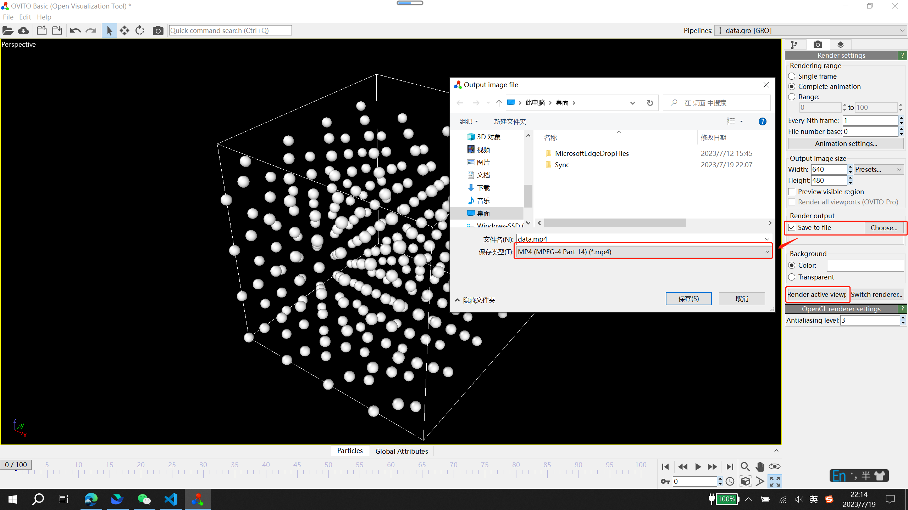

# ABACUS 分子动力学使用教程

<strong>作者：刘裕，邮箱：liuyu@stu.pku.edu.cn</strong>

<strong>审核：陈默涵，邮箱：mohanchen@pku.edu.cn</strong>

<strong>最后更新时间：2024/09/19</strong>

<strong>在Bohrium Notebook上快速学习：</strong><a href="https://nb.bohrium.dp.tech/detail/2241262724" target="_blank"></a>

# 一、分子动力学方法简介

<strong>分子动力学（Molecular Dynamics，简称 MD）：</strong>一种模拟原子体系随时间运动的方法，被广泛的用来研究与原子运动路径相关的一些基本过程，如相变、扩散、化学反应等等。本教程旨在介绍 ABACUS 中的分子动力学功能，分子动力学模拟重要的一件事情是如何选取精度和效率的平衡，其中精度高低主要取决于势函数的准确程度，而效率主要受限于求出每个原子的能量和受力的计算量。

<strong>经典分子动力学（Classical MD，简称 CMD）：</strong>通过构建描述原子间相互作用的势函数，获得每个原子的受力（受力等于能量对原子位置的导数），再通过积分运动方程来获得每个原子的下一时刻位置，从而获得随时间演化的粒子位置和速度。当系统处在一定的密度、温度和压强等物理条件限制下，可以结合统计物理的方法计算物质的性质。具体来说，采取某个系综后，对粒子位置和速度采样，之后统计出体系的热力学宏观性质。

<strong>从头算分子动力学（ab initio molecular dynamics，简称 AIMD）：</strong>也称为第一性原理的分子动力学方法（first-principles molecular dynamics，简称 FPMD），该方法采用的是第一性原理方法（例如密度泛函理论）来计算体系的势能面，因此计算量相比于经典分子动力学方法要昂贵很多。

<strong>ABACUS 的分子动力学功能：</strong>支持第一性原理分子动力学 FPMD 方法，也支持经典的 Lennard-Jones（LJ 对势）的分子动力学模拟。此外，ABACUS 还支持深度势能分子动力学（Deep Potential Molecular Dynamics，简称 DPMD）方法，此时需要编译 [DeePMD-kit](https://github.com/deepmodeling/deepmd-kit) 软件包并在编译原子算筹软件时进行动态库的链接。

# 二、文档和算例下载地址

ABACUS 里关于分子动力学方法的线上文档地址为：[http://abacus.deepmodeling.com/en/latest/advanced/md.html](http://abacus.deepmodeling.com/en/latest/advanced/md.html)

ABACUS 里关于分子动力学参数的线上文档地址为：

[http://abacus.deepmodeling.com/en/latest/advanced/input_files/input-main.html#molecular-dynamics](http://abacus.deepmodeling.com/en/latest/advanced/input_files/input-main.html#molecular-dynamics)

ABACUS 的 MD 算例下载地址为（国内 gitee）：

[https://gitee.com/mcresearch/abacus-user-guide/tree/master/examples/md](https://gitee.com/mcresearch/abacus-user-guide/tree/master/examples/md)

可以采用的下载命令是：
```
git clone https://gitee.com/mcresearch/abacus-user-guide.git
```

之后进入 `/abacus-user-guide/examples/md` 目录

或者采用 Github 仓库地址：

[https://github.com/MCresearch/abacus-user-guide/tree/master/examples/md](https://github.com/MCresearch/abacus-user-guide/tree/master/examples/md)

注：算例仓库里面包含 `1_AIMD`，`2_LJMD`（采用 Lennard-Jones 经典势做 MD），`3_DPMD`（采用深度势能方法做 MD）和 `4_FIRE`（采用 FIRE 算法做结构优化）四个目录。

注：以上算例要在 ABACUS v3.2.1 版本及以上可以运行成功，并且我们强烈建议下载使用 ABACUS 最新版本！

## 1. 第一性原理分子动力学（AIMD）

进入 `1_AIMD` 目录，该目录提供了 8 个输入文件，使用的时候将 `INPUT_*` 复制为 `INPUT` 即可（`INPUT_*` 代表从 `INPUT_0` 到 `INPUT_7` 共 8 个不同的 INPUT 文件，对应 8 种不同的 MD 算法）。该算例采用 8 原子的金刚石结构 Si，晶格结构放在 `STRU` 文件里，布里渊区的 k 点采样放在 `KPT` 文件里。

8 个 INPUT 文件对应的 MD 方法如下：

`INPUT_0`：采用 NVE 微正则系综

`INPUT_1`：采用 NVT 正则系综

`INPUT_2`：采用 Langevin 热库

`INPUT_3`：采用 Anderson 热库，NVT 系综

`INPUT_4`：采用 MSST 方法

`INPUT_5`：采用 Berendsen 热库，NVT 系综

`INPUT_6`：采用 rescaling 方法，NVT 系综

`INPUT_7`：采用 rescale_v 方法，NVT 系综

以 `INPUT_0` 为例：

```bash
INPUT_PARAMETERS
#Parameters (1.General)
suffix                 Si_nve
calculation            md
nbands                 20
symmetry               0
pseudo_dir             ../../../tests/PP_ORB
orbital_dir            ../../../tests/PP_ORB

#Parameters (2.Iteration)
ecutwfc                30
scf_thr                1e-5
scf_nmax               100

#Parameters (3.Basis)
basis_type             lcao
ks_solver              genelpa
gamma_only             1

#Parameters (4.Smearing)
smearing_method        gaussian
smearing_sigma         0.001

#Parameters (5.Mixing)
mixing_type            pulay
mixing_beta            0.3
chg_extrap             second-order

#Parameters (6.MD)
md_type                nve
md_nstep               10
md_dt                  1
md_tfirst              300
```

这些参数在 [ABACUS 线上文档](http://abacus.deepmodeling.com/en/latest/advanced/input_files/input-main.html#molecular-dynamics)中均有说明，在这里再进行简单概述：

- calculation：设置 ABACUS 计算类型，做分子动力学模拟请设置为 md。
- esolver_type：给定原子位置进行系统能量的计算，默认 Kohn-Sham 密度泛函理论（ksdft），还可以设置 LJ 势（lj）或者深度势能（dp）。理论上来说，所有的 esolver_type 都可以用于 MD 计算。
- chg_extrap：电荷外插法，在 relax 和 md 计算中可用于优化电荷密度初始化，加速电子迭代收敛，MD 中可以设置为 second-order。
- md_type：MD 算法种类，默认是正则系统 nvt，这里的例子选择的是 nve，即 NVE 微正则系综。
- md_nstep：MD 模拟的总步数。
- md_dt：MD 计算每一步的时间步长（单位是 fs），与 md_nstep 共同决定 MD 总时长。
- md_tfirst：MD 系统的初始温度（单位是 K）。

## 2. Lennard-Jones 势函数

进入 `2_LJMD` 目录，ABACUS 软件包中提供了一个采用 Lennard-Jones（LJ）经典势函数进行 MD 模拟的算例，该算例采用 LJ 对势作为能量求解器来做经典分子动力学，初始结构是边长 20 埃的正方体盒子中的 256 个无序 He 原子。

### 2.1 LJ 对势

LJ 对势的解析形式如下：$$u^{ij}$$表示原子 i 与原子 j 之间的相互作用能，$$r^{ij}$$表示这两个原子之间的距离，$$\epsilon$$，$$\sigma$$和$$r_{cut}$$则是 LJ 势需要的 3 个参数。LJ 势只考虑截断半径$$r_{cut}$$内的近邻原子 j 对中心原子 i 的能量贡献。

$$
\begin{array}{c}
u^{i j}=4 \varepsilon\left[\left(\frac{\sigma}{r_{i j}}\right)^{12}-\left(\frac{\sigma}{r_{i j}}\right)^{6}\right] \\
\boldsymbol{F}_{i}=-\nabla_{i} U=\sum_{j} 4 \varepsilon\left[12\left(\frac{\sigma}{r_{i j}}\right)^{12}-6\left(\frac{\sigma}{r_{i j}}\right)^{6}\right] \frac{\boldsymbol{r}_{i}-\boldsymbol{r}_{j}}{r_{i j}^{2}} H\left(r_{c u t}-r_{i j}\right)
\end{array} \\
H(x)=\left\{\begin{array}{l}
0\ \ \ \ (x<0) \\
1\ \ \ \ (x>0)
\end{array}\right.\\
$$

### 2.2 STRU

LJMD 是经典分子动力学，不需要提供 `KPT`，赝势和轨道文件，`STRU` 的前面几部分如下：

```bash
ATOMIC_SPECIES
He 4.0026

LATTICE_CONSTANT
1.889727

LATTICE_VECTORS
20 0 0
0 20 0
0 0 20

ATOMIC_POSITIONS
Cartesian

He #label
0 #magnetism
256 #number of atoms
```

- ATOMIC_SPECIES：不需要提供赝势信息
- NUMERICAL_ORBITAL：不需要添加轨道信息

### 2.3 INPUT

`INPUT` 文件中的参数也需要做少量修改：

```bash
INPUT_PARAMETERS
#Parameters (General)
suffix              autotest

calculation         md
pseudo_dir          ../../PP_ORB

#Parameters (esolver)
esolver_type        lj
lj_rcut             8.5
lj_epsilon          0.01032
lj_sigma            3.405

cal_force           1
cal_stress          1

#Parameters (MD)
md_nstep            5
md_type             nve
md_dt               1
md_tfirst           300

init_vel            1
```

- esolver_type：指定为 lj 就可以做 Lennard-Jones 经典势函数。
- lj_rcut：LJ 对势的参数，即截断半径$$r_{cut}$$。
- lj_epsilon：LJ 对势的参数，即$$\epsilon$$。
- lj_sigma：LJ 对势的参数，即$$\sigma$$。
- init_vel：读取 `STRU` 中的原子速度信息，原子单位制。

## 3. 深度势能（Deep Potential）

ABACUS 软件包中提供了一个 DPMD 的算例，进入 `3_DPMD` 目录。该算例采用 DP 模型（DeePMD-kit 产生的深度势能模型）作为能量求解器来做基于机器学习的分子动力学，初始结构是 864 个无序铝原子。

### 3.1 DP 模型

[DeePMD-kit](https://github.com/deepmodeling/deepmd-kit) 是一种基于机器学习的分子动力学模拟方法，该方法是通过使用第一性原理计算数据对深度神经网络模型进行训练，从而得到通用的多体势能模型（DP 模型）。

### 3.2 编译方式

ABACUS 采用 DP 模型做 MD 计算需要编译与 DeePMD-kit 的接口，[cmake](http://abacus.deepmodeling.com/en/latest/advanced/install.html#build-with-deepmd-kit) 以及 [makefile](http://abacus.deepmodeling.com/en/latest/advanced/install.html#add-deepmd-kit-support) 编译方式可以参考 ABACUS 线上文档。

### 3.3 INPUT 文件设置

DPMD 是经典分子动力学，不需要提供 KPT，赝势和轨道文件

INPUT 文件中的参数需要做少量修改：

```bash
INPUT_PARAMETERS
#Parameters        (General)
suffix              autotest
calculation         md

esolver_type        dp
pot_file            ../../PP_ORB/Al-SCAN.pb

cal_force           1
cal_stress          1

md_nstep            3
md_type             msst
md_dt               1
md_tfirst           200
md_dumpfreq         1
md_restartfreq      1

msst_qmass          200
msst_vel            0.028
msst_vis            0.3

init_vel            1
```

- esolver_type：设置为 dp
- pot_file：DP 模型文件路径
- md_dumpfreq：MD 输出文件 MD_dump 中原子以及晶胞信息的输出频率
- md\_restartfreq：结构文件 STRU\_MD\_\${istep} 的输出频率，MD 续算文件 Restart_md.dat 的更新频率


# 三、MD 输出和续算功能

## 1. MD 输出文件

ABACUS 的 MD 模拟会产生 3 类输出文件：结构文件 `STRU_MD_${istep}`，续算文件 `Restart_md.dat`，信息文件 `MD_dump`。

### 1.1 结构文件 STRU\_MD\_${istep}

参数 `md_restartfreq` 控制 OUT.\${suffix}/STRU/文件夹中结构文件STRU\_MD\_\${istep}的输出频率，该文件格式与输入结构文件 STRU 相同，主要用于 MD 续算。这里 istep 代表离子步，从 0 开始计数。

### 1.2 续算文件 Restart_md.dat

参数 `md_restartfreq` 控制 OUT.${suffix}/Restart_md.dat 的更新频率，用于 MD 续算。

### 1.3 信息文件 MD_dump

参数 `md_dumpfreq` 控制 OUT.${suffix}/MD_dump 文件的追加输出频率，该文件输出每 `md_dumpfreq` 步的 MD 信息，包括 MD 步数，晶格常数，晶格矢量，晶格维里，原子编号，原子位置，原子受力，原子速度。其中，晶格维里，原子受力，原子速度可以通过输入参数 `dump_virial`，`dump_force`，`dump_vel` 控制是否输出。

```bash
MDSTEP:  0
LATTICE_CONSTANT: 5.397605400000 Angstrom
LATTICE_VECTORS
  0.500000000000  0.500000000000  0.000000000000
  0.500000000000  0.000000000000  0.500000000000
  0.000000000000  0.500000000000  0.500000000000
VIRIAL (kbar)
  123.045275146001  -3.807535058112  -13.541439282961
  -3.807535058112  124.421300186299  24.047959743672
  -13.541439282961  24.047959743672  125.016024430342
INDEX    LABEL    POSITION (Angstrom)    FORCE (eV/Angstrom)    VELOCITY (Angstrom/fs)
  0  Si  0.000000000000  0.000000000000  0.000000000000  -0.885362725233  0.500467424348  0.150239620206  -0.003506076235  0.000412570794  0.000094403053
  1  Si  1.300822817264  1.376389287977  1.354798867769  0.885362725233  -0.500467424348  -0.150239620206  0.003506076235  -0.000412570794  -0.000094403053

MDSTEP:  1
LATTICE_CONSTANT: 5.397605400000 Angstrom
LATTICE_VECTORS
  0.500000000000  0.500000000000  0.000000000000
  0.500000000000  0.000000000000  0.500000000000
  0.000000000000  0.500000000000  0.500000000000
VIRIAL (kbar)
  123.051574098220  -2.465332696362  -10.608474638302
  -2.465332696362  123.587154919736  16.307187552709
  -10.608474638302  16.307187552709  123.960669810770
INDEX    LABEL    POSITION (Angstrom)    FORCE (eV/Angstrom)    VELOCITY (Angstrom/fs)
  0  Si  5.389827754452  2.701629481339  2.699621723525  -0.602062173578  0.391990779819  0.096323485153  -0.010548689866  0.004659227844  0.001267888485
  1  Si  1.308600113700  1.373562332082  1.353979669688  0.602062173578  -0.391990779819  -0.096323485153  0.010548689866  -0.004659227844  -0.001267888485

MDSTEP:  2
LATTICE_CONSTANT: 5.397605400000 Angstrom
LATTICE_VECTORS
  0.500000000000  0.500000000000  0.000000000000
  0.500000000000  0.000000000000  0.500000000000
  0.000000000000  0.500000000000  0.500000000000
VIRIAL (kbar)
  122.953007762375  -0.240072876170  -4.211946086929
  -0.240072876170  122.930693852071  3.378536464243
  -4.211946086929  3.378536464243  122.992607262385
INDEX    LABEL    POSITION (Angstrom)    FORCE (eV/Angstrom)    VELOCITY (Angstrom/fs)
  0  Si  5.376757913710  2.708010452044  2.701308224779  -0.124946902346  0.155367961328  0.009378252255  -0.012739769308  0.006644009927  0.001613591879
  1  Si  1.321669954442  1.367181361377  1.352293168434  0.124946902346  -0.155367961328  -0.009378252255  0.012739769308  -0.006644009927  -0.001613591879

MDSTEP:  3
LATTICE_CONSTANT: 5.397605400000 Angstrom
LATTICE_VECTORS
  0.500000000000  0.500000000000  0.000000000000
  0.500000000000  0.000000000000  0.500000000000
  0.000000000000  0.500000000000  0.500000000000
VIRIAL (kbar)
  122.881221914392  1.206247195689  2.345023988024
  1.206247195689  123.110079832453  -8.436042066928
  2.345023988024  -8.436042066928  123.123976300784
INDEX    LABEL    POSITION (Angstrom)    FORCE (eV/Angstrom)    VELOCITY (Angstrom/fs)
  0  Si  5.364727401370  2.714719749381  2.702800880457  0.310711926370  -0.086233730382  -0.043760493686  -0.009222308089  0.005510922784  0.001122226311
  1  Si  1.333700466782  1.360472064040  1.350800512757  -0.310711926370  0.086233730382  0.043760493686  0.009222308089  -0.005510922784  -0.001122226311
```

## 2 MD 续算功能

如果 ABACUS 运行达到指定的 MD 步数，或者计算中断，可以通过 MD 续算功能继续之前的 MD 计算。

以上一个 `INPUT` 文件为例：

```bash
INPUT_PARAMETERS
#Parameters        (General)
suffix              autotest
calculation         md
pseudo_dir          ../../PP_ORB

esolver_type        dp
pot_file            ../../PP_ORB/Al-SCAN.pb

cal_force           1
cal_stress          1

md_nstep            3
md_type             msst
md_dt               1
md_tfirst           200
md_dumpfreq         1
md_restartfreq      1
md_restart          1

msst_qmass          200
msst_vel            0.028
msst_vis            0.3

init_vel            1
```

- md\_restart：控制续算的开关，在 MD 续算时将这个参数设为 1，其他参数不变。当 md\_restart 设为 1，ABACUS 会读取`${read_file_dir}/Restart_md.dat`文件，从中获取当前MD步数istep以及续算所需的其他参数如恒温器以及恒压器的信息，根据istep从`OUT.${suffix}/STRU/` 文件夹中读取相应的结构文件 `STRU_MD_${istep}`，之后就可以进行 MD 续算了。

# 四、MD 后处理

目前主流的可视化软件如 [VESTA](https://jp-minerals.org/vesta/en/)、[VMD](https://www.ks.uiuc.edu/Research/vmd/)、[OVITO](https://www.ovito.org/) 并不支持 ABACUS 的文件格式，因此我们需要通过一些后处理软件实现 ABACUS 的 STRU、MD_dump 文件与常用文件格式的转化。我们比较推荐的后处理软件有：

## 1 ASE

- 官网：https://wiki.fysik.dtu.dk/ase/
- 用法参考 ABACUS 线上文档：[http://abacus.deepmodeling.com/en/latest/advanced/interface/ase.html](http://abacus.deepmodeling.com/en/latest/advanced/interface/ase.html)

## 2 dpdata

- github 网址：[https://github.com/deepmodeling/dpdata](https://github.com/deepmodeling/dpdata)
- gitee 网址：[https://gitee.com/deepmodeling/dpdata](https://gitee.com/deepmodeling/dpdata)

## 3 案例

现在我们用 LJMD 算例来演示如何采用<strong>dpdata+OVITO</strong>的方式在 MD 计算完成后制作分子动力学轨迹动画。

### 3.1 MD 计算

下载案例文件

```bash
$ git clone https://gitee.com/mcresearch/abacus-user-guide
```

进入 LJMD 文件夹

```bash
$ cd abacus-user-guide/examples/md/2_LJMD
```

修改 INPUT 参数，把 md_nstep 改为 100

```bash
INPUT_PARAMETERS
#Parameters (General)
suffix              autotest

calculation         md
pseudo_dir          ../../PP_ORB

#Parameters (esolver)
esolver_type        lj
lj_rcut             8.5
lj_epsilon          0.01032
lj_sigma            3.405

cal_force           1
cal_stress          1

#Parameters (MD)
md_nstep            100
md_type             nve
md_dt               1
md_tfirst           300

init_vel            1
```

运行 abacus

```bash
$ abacus
```

### 3.2 dpdata 转化格式

安装 dpdata

```bash
$ git clone https://github.com/deepmodeling/dpdata.git dpdata
$ cd dpdata
$ pip install .
```

运行 dpdata，将 MD_dump 文件转化为 GROMACS 的 gro 格式的文件 data.gro

```bash
$ python3
>>> import dpdata
>>> data = dpdata.LabeledSystem("./", fmt="abacus/md")
>>> data.to_gro("data.gro")
```

### 3.3 OVITO 制作动画

打开 OVITO，点击左上角 load file，选择上一步的 data.gro 文件


右上角 rendering settings



点击 Render active viewport 即可保存动画文件



# 五、特殊的 MD 方法

## 1. Fast Inertial Relaxation Engine

ABACUS 中实现了一种特殊的基于 MD 的 [Fast Inertial Relaxation Engine](https://doi.org/10.1103/PhysRevLett.97.170201) (FIRE)结构优化方法，该算法比共轭梯度法的标准实现快得多，具有额外的速度修改和自适应时间步长，具有优异的优化效率。

以上面提供的 `4_FIRE` 算例为例，我们可以介绍一下所需的参数如下：

```shell
INPUT_PARAMETERS
#Parameters (1.General)
suffix                 Si_fire
calculation            md
nbands                 6
symmetry               0
pseudo_dir             ../../PP_ORB
orbital_dir            ../../PP_ORB

#Parameters (2.Iteration)
ecutwfc                30
scf_thr                1e-8
scf_nmax               100

#Parameters (3.Basis)
basis_type             pw

#Parameters (4.Smearing)
smearing_method        gaussian
smearing_sigma         0.001

#Parameters (5.Mixing)
mixing_type            pulay
mixing_beta            0.3
chg_extrap             second-order

#Parameters (6.MD)
md_type                fire
md_nstep               100
md_dt                  1
md_tfirst              300

force_thr_ev           0.001
```

- calculation：FIRE 算法是基于 MD 方法的，因此需要将 calculation 设为 md
- md_type：采用 FIRE 算法，需要设为 fire
- md_tfirst：MD 需要离子速度，因此需要通过设置初始温度来随机生成离子速度，或者在 `STRU` 文件中手动设置初始速度
- force_thr_ev：离子受力的收敛阈值，当离子受力的每个分量均小于该阈值或者 MD 运行至最大步数时，MD 终止
