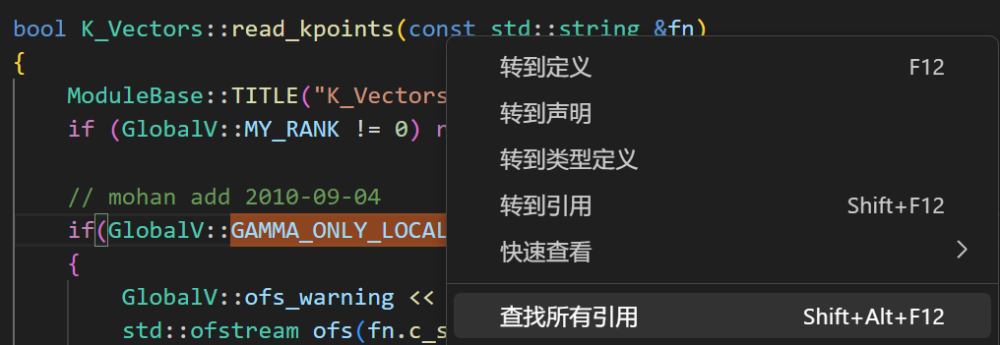
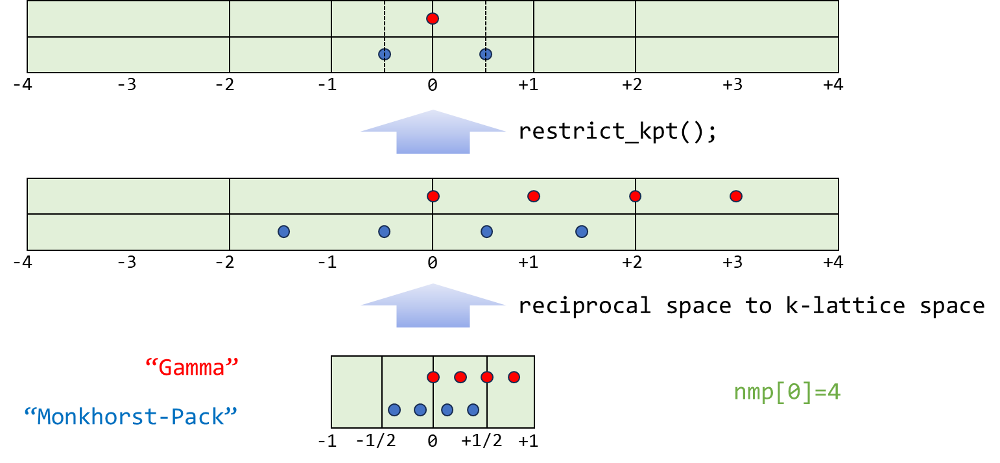
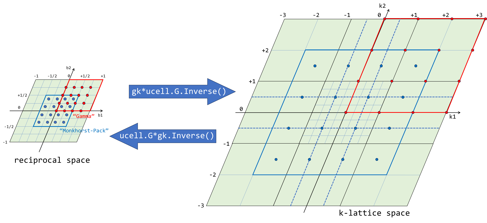

# Introduction to ABACUS: Path to PW calculation - Part 5

<strong>作者：黄一珂，邮箱：huangyk@aisi.ac.cn</strong>

<strong>审核：陈默涵，邮箱：mohanchen@pku.edu.cn</strong>

<strong>飞书链接：[Introduction to ABACUS: Path to PW calculation - Part 5](https://xmywuqhxb0.feishu.cn/docx/TK25dVD8XolWUCx1S9bcRskJnVc)</strong>

> 📃<strong>写在前面</strong>
>
> 1. 不脱离代码——避免读者看完手册后对代码没有一丁点概念
> 2. 不堆砌代码解释——避免平庸的代码解释，努力兼顾拉近读者和代码距离的同时，做到提纲挈领，不逐行复制代码后进行停留在代码语义上的解释

<strong>Driver</strong>

<strong>Driver::atomic_world()</strong>

<strong>Driver::driver_run()</strong>

# 多层继承：Init() functions in esolver class

## 盯紧数据流：Constructor the ESolver_KS()

跟随继承关系，我们从 `ESolver_FP` 来到 `ESolver_KS`，之后我们还会进入下一层 `ESolver_KS_PW`。和之前一样，我们仍然需要关心从 `ESolver_FP` 到 `ESolver_KS`，多了哪些数据成员，数据成员在何时被分配内存，何时拥有具体数值，对之后理解程序的整体流程控制十分重要。

check 头文件中数据成员的声明，并且牢记父类的各成员也在当前类中存在：

```cpp
namespace ModuleESolver
{

    template<typename FPTYPE, typename Device = psi::DEVICE_CPU>
    class ESolver_KS : public ESolver_FP
    {
    public:
        ....// constructor and destructor declarations omitted
        // present class    parent class inherited
        //                  （will not re-introduce here）
        double scf_thr;     ModulePW::PW_Basis* pw_rho;
        double drho;        ModulePW::PW_Basis_Big* pw_big;
        int maxniter;       elecstate::ElecState* pelec = nullptr;
        int niter;          Charge chr;
        bool conv_elec;     ModuleSymmetry::Symmetry symm;
        int out_freq_elec;  psi::Psi<std::complex<double>>* psi = nullptr;
                            psi::Psi<double>* psid = nullptr;
                            Structure_Factor sf;
                            K_Vectors kv;
        ....// member function(s) omitted
    protected:
        hsolver::HSolver<FPTYPE, Device>* phsol = nullptr;
        hamilt::Hamilt<FPTYPE, Device>* p_hamilt = nullptr;
        ModulePW::PW_Basis_K* pw_wfc = nullptr;
        Charge_Mixing* p_chgmix = nullptr;
        wavefunc wf;
        Charge_Extra CE;
        std::string basisname;
```

从构造函数中查看哪些量被初始化：

```cpp
namespace ModuleESolver
{
    template<typename FPTYPE, typename Device>
    ESolver_KS<FPTYPE, Device>::ESolver_KS()
    {
        ....
        scf_thr = GlobalV::SCF_THR;
        drho = 0.0;
        maxniter = GlobalV::SCF_NMAX;
        niter = maxniter;
        out_freq_elec = GlobalV::OUT_FREQ_ELEC;

        pw_wfc = new ModulePW::PW_Basis_K_Big(GlobalV::device_flag, GlobalV::precision_flag);
        ModulePW::PW_Basis_K_Big* tmp = static_cast<ModulePW::PW_Basis_K_Big*>(pw_wfc);
        tmp->setbxyz(INPUT.bx,INPUT.by,INPUT.bz);

        p_chgmix = new Charge_Mixing();
        p_chgmix->set_rhopw(this->pw_rho);
        p_chgmix->set_mixing(INPUT.mixing_mode, INPUT.mixing_beta, INPUT.mixing_ndim, INPUT.mixing_gg0, INPUT.mixing_tau);

        if (std::abs(INPUT.mixing_beta + 10.0) < 1e-6) p_chgmix->need_auto_set();

        this->wf.init_wfc = INPUT.init_wfc;
        this->wf.mem_saver = INPUT.mem_saver;
        this->wf.out_wfc_pw = INPUT.out_wfc_pw;
        this->wf.out_wfc_r = INPUT.out_wfc_r;
    }
```

因此当调用 `ESolver_KS::ESolver_KS()` 时，除了父类中各函数会被初始化外，另有 `wavefunc` 类 `wf`、`Charge_Extra` 类 `CE` 被初始化并分配内存，此外还有 `hsolver::HSolver<FPTYPE, Device>` 类 `phsol`、`hamilt::Hamilt<FPTYPE, Device>` 类 `p_hamilt`、`ModulePW::PW_Basis_K` 类 `pw_wfc`、`Charge_Mixing` 类 `p_chgmix` 指针被创建。在执行构造函数过程中，有 `pw_wfc`、`p_chgmix` 被分配内存，因此调用其构造函数。

| <strong>wavefunc 类数据成员</strong> | <strong>在头文件中初始化值</strong> | <strong>在构造函数中初始化值</strong> |
| ------------------------------------ | ----------------------------------- | ------------------------------------- |
| `allocate`                           |                                     |                                       |
| `out_wfc_pw`                         |                                     |                                       |
| `out_wfc_r`                          | `0`                                 |                                       |
| `init_wfc`, `mem_saver`              |                                     |                                       |
| `R`, `Rmax`                          |                                     |                                       |

| <strong>Charge_Extra 类数据成员</strong> | <strong>在头文件中初始化值</strong> | <strong>在构造函数中初始化值</strong> |
| ---------------------------------------- | ----------------------------------- | ------------------------------------- |
| `istep`                                  | 0                                   |                                       |
| `pot_order`, `rho_extr`                  |                                     |                                       |
| `dis_old1`, `dis_old2`, `dis_now`        | `nulltpr`                           |                                       |
| `alpha`,`beta`                           |                                     |                                       |

⚙ 两类均基本没有数据成员在对象建立时被赋值。然而通过上面代码块第 23-26 行可以发现，`wavefunc` 类 `wf` 的数据成员直接可以被访问，直接导入（拷贝）`Input` 类对象 `INPUT` 的数据成员，即 `wavefunc` 类的数据成员处于直接暴露的状态，这违反了封装理念。更好一点的做法是为每个类建立 `getter` 和 `setter` 函数，通过此两者来访问和修改成员变量，但更多的封装理念此处不再赘述。

接下来我们对 `ESolver_KS()` 中的其他操作以及其具体结果进行介绍。

### Constructor the ModulePW::PW_Basis_K_Big()

`ModulePW::PW_Basis_K_Big` 类的构造函数进行过一次重载，此时调用的版本为重载版本。在重载版本中，完全为继承 `PW_Basis` 的构造函数对应版本，但内容简单：

```cpp
namespace ModulePW
{
class PW_Basis_Big: public PW_Basis
{
public:
    ....
    PW_Basis_Big(std::string device_, std::string precision_) : PW_Basis(device_, precision_) {}
```

```cpp
namespace ModulePW
{
....
PW_Basis::PW_Basis(std::string device_, std::string precision_) : device(std::move(device_)), precision(std::move(precision_)) {
    classname="PW_Basis";
    this->ft.set_device(this->device);
    this->ft.set_precision(this->precision);
}
```

```cpp
void FFT::set_device(std::string device_) {
    this->device = std::move(device_);
}

void FFT::set_precision(std::string precision_) {
    this->precision = std::move(precision_);
}
```

### Constructor the Charge_Mixing()

我们按照相同路数查看 `Charge_Mixing` 类的构造函数：

```cpp
Charge_Mixing::Charge_Mixing()
{
    rstep = 0; dstep = rstep - 1;
    initp = false; initb = false;
}
```

以及其所属类的指针 `p_chgmix` 的相关调用操作：

```cpp
        p_chgmix = new Charge_Mixing();
        p_chgmix->set_rhopw(this->pw_rho);
        p_chgmix->set_mixing(INPUT.mixing_mode,
                             INPUT.mixing_beta,
                             INPUT.mixing_ndim,
                             INPUT.mixing_gg0,
                             INPUT.mixing_tau);
        // using bandgap to auto set mixing_beta
        if (std::abs(INPUT.mixing_beta + 10.0) < 1e-6) p_chgmix->need_auto_set();
        else if (INPUT.mixing_beta > 1.0 || INPUT.mixing_beta < 0.0)
        {
            ModuleBase::WARNING("INPUT", "You'd better set mixing_beta to [0.0, 1.0]!");
        }
```

`Charge_mixing::set_rhopw()` 函数的操作十分简单，即从括号中形参复制到自己的成员变量 `Charge_mixing::rhopw` 中，其中形参类型被指定为 `ModulePW::PW_Basis*`。

```cpp
void Charge_Mixing::set_rhopw(ModulePW::PW_Basis* rhopw_in)
{
    this->rhopw = rhopw_in;
}
```

```cpp
void Charge_Mixing::set_mixing(const std::string &mixing_mode_in, const double &mixing_beta_in, const int &mixing_ndim_in, const double &mixing_gg0_in, const bool &mixing_tau_in)
{
    this->mixing_mode = mixing_mode_in;
    this->mixing_beta = mixing_beta_in;
    this->mixing_ndim = mixing_ndim_in;
    this->mixing_gg0 = mixing_gg0_in; //mohan add 2014-09-27
    this->mixing_tau = mixing_tau_in;
....
}
```

而因为在 `module_io/input.cpp` 中有 `INPUT.mixing` 初始化为-10，因此 if 判断中的满足意味着默认值未被修改，因而调用 `Charge_mixing::need_auto_set()`，将 `Charge_mixing::autoset` 置为 `true`。

```cpp
void Charge_Mixing::need_auto_set()
{
    this->autoset = true;
}
```

## Trigger: ESolver_KS::Init()

```cpp
    template<typename FPTYPE, typename Device>
    void ESolver_KS<FPTYPE, Device>::Init(Input& inp, UnitCell& ucell)
    {
        ESolver_FP::Init(inp,ucell);
        ucell.cal_nelec(GlobalV::nelec);

        XC_Functional::set_xc_type(ucell.atoms[0].ncpp.xc_func);
....
        this->kv.set(this->symm, GlobalV::global_kpoint_card, GlobalV::NSPIN, ucell.G, ucell.latvec);
        ....
        if(GlobalV::BASIS_TYPE=="pw" || GlobalV::CALCULATION=="get_wf")
        {
    #ifdef __MPI
            this->pw_wfc->initmpi(GlobalV::NPROC_IN_POOL, GlobalV::RANK_IN_POOL, POOL_WORLD);
    #endif
            this->pw_wfc->initgrids(inp.ref_cell_factor * ucell.lat0, ucell.latvec, this->pw_rho->nx, this->pw_rho->ny, this->pw_rho->nz);
            this->pw_wfc->initparameters(false, inp.ecutwfc, this->kv.nks, this->kv.kvec_d.data());
#ifdef __MPI
            if(INPUT.pw_seed > 0)
            {
                MPI_Allreduce(MPI_IN_PLACE, &this->pw_wfc->ggecut, 1, MPI_DOUBLE, MPI_MAX , MPI_COMM_WORLD);
            }
#endif
            this->pw_wfc->setuptransform();
            for (int ik = 0; ik < this->kv.nks; ++ik) this->kv.ngk[ik] = this->pw_wfc->npwk[ik];
            this->pw_wfc->collect_local_pw(); 
            ....
        }
        GlobalC::Pgrid.init(this->pw_rho->nx, this->pw_rho->ny, this->pw_rho->nz, this->pw_rho->nplane, this->pw_rho->nrxx, pw_big->nbz, pw_big->bz);
        this->sf.setup_structure_factor(&GlobalC::ucell, this->pw_rho);

        CE.Init_CE(GlobalC::ucell.nat);
    }
```

首先调用了两函数，以 `UnitCell::cal_nelec()` 计算体系中总电子数，并存储在 `GlobalV::nelec`，以及 `XC_Functional::set_xc_type()` 根据输入文件中设置参数，为三个泛函相关量（`XC_Functional::func_id`, `XC_Functional::func_type` 和 `XC_Functional::use_libxc`）进行赋值，见 `source/module_hamilt_general/module_xc/xc_funtional.cpp: line 26`（[Link](https://github.com/deepmodeling/abacus-develop/blob/develop/source/module_hamilt_general/module_xc/xc_functional.cpp#L26)）。

| 变量                       | 数据类型         | 描述                                                                                                                                                                                                                                                     |
| -------------------------- | ---------------- | -------------------------------------------------------------------------------------------------------------------------------------------------------------------------------------------------------------------------------------------------------- |
| `XC_Functional::func_id`   | std::vector<int> | 首先将交换泛函压入，然后是关联泛函。预先通过宏对每种泛函和整数间进行对应，见 `source/module_hamilt_general/module_xc/xc_funcs.h`（[Link](https://github.com/deepmodeling/abacus-develop/blob/develop/source/module_hamilt_general/module_xc/xc_funcs.h)） |
| `XC_Functional::func_type` | int              | LDA: `1`; GGA: `2`; meta-GGA: `3`; hybrid GGA: `4`; hybrid meta-GGA: `5`                                                                                                                                                                                 |
| `XC_Functional::use_libxc` | bool             |                                                                                                                                                                                                                                                          |

<em>因 Symmetry::analy_sys()功能尚未完全部署，暂时跳过。</em>

### 波函数 k 点采样：K_Vectors::set()

在一般的第一性原理软件中，或对建模为周期性体系（认定其中包含平移对称性的体系）而言，平移对称性决定了$$\mathbf{k}$$是量子数之一，因此为区分态，并且计算态，k 点采样对于准确计算体系的性质尤为重要（尽量准确计算占据态），但这一 k 点所对应$$\mathbf{k}$$需要和原本用于展开波函数的平面波基其$$\mathbf{G}$$加以区分：$$\mathbf{G}$$（通过 ecut 决定）只能决定当前待求波函数的精度，但还并不能决定当前体系的性质能否计算准确。回顾 Bloch 定理，在 k 点$$\mathbf{k}$$，第 n 个能级在实空间坐标表象下的波函数为：

$$
\psi_{\text{n}\mathbf{k}}(\mathbf{r})=e^{i\mathbf{k}\cdot\mathbf{r}}u_{\text{n}\mathbf{k}}(\mathbf{r})
$$

平面波基的$$\mathbf{G}$$出现在 Bloch 调幅函数$$u_{\text{n}\mathbf{k}}(\mathbf{r})$$中：

$$u_{\text{n}\mathbf{k}}(\mathbf{r})=\sum_{\mathbf{G}}c_\mathbf{G}^{(\text{n}\mathbf{k})}e^{i\mathbf{G}\cdot\mathbf{r}}$$。

老生常谈，平移对称性实际上是指$$\psi_{\text{n}\mathbf{k}}(\mathbf{r}+n\mathbf{a})=\psi_{\text{n}\mathbf{k}}(\mathbf{r})$$，则$$\psi_{\text{n}\mathbf{k}}(\mathbf{r}+n\mathbf{a})=e^{i\mathbf{k}\cdot(\mathbf{r}+n\mathbf{a})}u_{\text{n}\mathbf{k}}(\mathbf{r}+n\mathbf{a})$$。认定 Bloch 函数必有该性质，则实际上需要满足：

$$2N\pi=n(\mathbf{k}\cdot\mathbf{a})$$,

一维：$$2N\pi/n|\mathbf{a}|=|\mathbf{k}|$$

因此不同 k 点的考虑实际是在考虑体系的不同平移对称性。当 k 点采样无穷多时，即等同于考虑体系（波函数）的所有平移对称性。

```cpp
void K_Vectors::set(const ModuleSymmetry::Symmetry &symm, const std::string &k_file_name, const int& nspin_in, const ModuleBase::Matrix3 &reciprocal_vec, const ModuleBase::Matrix3 &latvec)
{
....
        this->nspin = nspin_in;
        if(this->nspin==4) this->nspin = 1;//zhengdy-soc
....
        bool read_succesfully = this->read_kpoints(k_file_name);
#ifdef __MPI
        Parallel_Common::bcast_bool(read_succesfully);
#endif
        if(!read_succesfully) {....}

    std::string skpt1=""; std::string skpt2="";

    if(!berryphase::berry_phase_flag && ModuleSymmetry::Symmetry::symm_flag != -1)
    {
        bool match = true;
        this->ibz_kpoint(symm, ModuleSymmetry::Symmetry::symm_flag, skpt1, GlobalC::ucell, match);
#ifdef __MPI
            Parallel_Common::bcast_bool(match);
#endif
        if (!match) {....}
        if (ModuleSymmetry::Symmetry::symm_flag || is_mp)
        {
            this->update_use_ibz();
            this->nks = this->nkstot = this->nkstot_ibz;
        }
    }

    this->set_both_kvec(reciprocal_vec, latvec, skpt2);
    if(GlobalV::MY_RANK==0) {....}

    int deg = 0;
    if(GlobalV::NSPIN == 1) deg = 2;
    else if(GlobalV::NSPIN == 2||GlobalV::NSPIN==4) deg = 1;
    else ModuleBase::WARNING_QUIT("K_Vectors::set", "Only available for nspin = 1 or 2 or 4");

    this->normalize_wk(deg);

        GlobalC::Pkpoints.kinfo(nkstot);
#ifdef __MPI
    this->mpi_k();
#endif

    this->set_kup_and_kdw();
    this->print_klists(GlobalV::ofs_running);
}
```

#### k 点生成：K_Vectors::read_kpoints()及变量赋值回溯复习

来到 `K_Vectors::read_kpoints()` 函数，对于前三条件判断，第一则为让非 rank0 processors 退出该函数，

```cpp
bool K_Vectors::read_kpoints(const std::string &fn)
{
    ModuleBase::TITLE("K_Vectors", "read_kpoints");
    if (GlobalV::MY_RANK != 0) return 1;
....
    if(GlobalV::GAMMA_ONLY_LOCAL)
    {
        ....
    }
    else if (GlobalV::KSPACING[0] > 0.0)
    {
        ....
```

第二和三涉及 `GlobalV` 中相关参数，按照 [Introduction to ABACUS: Path to PW calculation - Part 1](develop-path1.md) 相同方法进行变量赋值回溯，举例对于 `GlobalV::GAMMA_ONLY_LOCAL`:

首先鼠标右键拉取菜单，选择“查找所有引用”，



仔细检查侧边栏 Vscode 给出引用查找结果


基于我们当前对 ABACUS 工作流的了解，单击左侧 `input_conv.cpp` 文件后，跳转到 `input_conv.cpp` 相关行（line 328）：


证明此参数可能也在 `Input` 类方法中被读取。切换到文件浏览器侧边栏后直接打开 `input.cpp`，查找 `"gamma_only_local"` 相关内容：


寻得有效赋值操作：


寻找何时有 `“gamma_only == 1”` 条件：


然而，并非只要将 `gamma_only` 关键词在 `INPUT` 文件中置为 `true` 即可，因为在 line 2350，实际上 pw 基不支持该参数，因此对于 `esolver_type == esolver_ks_pw` 的情况，`gamma_only` 为 `false` 而 `gamma_only_local` 也从未改变其默认值 `false`。


类似地我们回溯 `GlobalV::kspacing[3]`，发现在 `input.cpp` 中有：


[Full List of INPUT Keywords ‒ ABACUS documentation](https://abacus.deepmodeling.com/en/latest/advanced/input_files/input-main.html)


即如果指定了一个值，则 `kspacing[1]` 和 `kspacing[2]` 拥有和 `kspacing[0]` 相同值，若定义三个值，则三个值各不相同，通过 `Input::read_kspacing()` 实现。定义值后，将覆盖写入 `KPT` 文件，因此在之后的读取过程中读入的结果其实是刚刚写的结果。

从 `examples` 文件夹中，可以知道 `KPT` 文件可能具有的格式，以及在当前函数中会被读取到何变量中。

`examples/scf/pw_Si2/INPUT` 和 `KPT`:

```cpp
INPUT_PARAMETERS
#Parameters (General)
pseudo_dir ../../../tests/PP_ORB 
symmetry 1 
#Parameters (Accuracy)
basis_type  pw
ecutwfc 60
scf_thr 1e-8
scf_nmax 100
```

```cpp
K_POINTS
0
Gamma
4 4 4 0 0 0
```

`examples/band/pw_Al/INPUT1` 和 `KPT`:

```cpp
INPUT_PARAMETERS
#Parameters (General)
pseudo_dir ../../../tests/PP_ORB
calculation scf
ntype 1 
symmetry 0
#Parameters (Methos)
basis_type pw
ecutwfc 50
scf_thr 1.0e-8 // about iteration
scf_nmax 100
smearing_method gauss
smearing_sigma 0.01
#Parameters (File)
out_chg 1
```

```cpp
K_POINTS
0
Gamma
4 4 4 0 0 0
```

`examples/band/pw_Al/INPUT2` 和 `KLINES`（❗ 注意，此时 `kpoint_file` 参数被赋予 `KLINES`）:

```cpp
INPUT_PARAMETERS
#Parameters (General)
kpoint_file KLINES
pseudo_dir ../../../tests/PP_ORB
calculation nscf
ntype 1
symmetry 0
#Parameters (Methos)
ecutwfc 50
basis_type pw
pw_diag_thr 1e-10
pw_diag_nmax 100
#Parameters (Accuracy)
smearing_method gauss
smearing_sigma 0.01
#Parameters (File)
init_chg file
out_band 1
```

```cpp
K_POINTS
8
Line
0.0 0.0 0.0 20
0.5 -0.5 0.5 20
0.0 0.0 0.5 20
0.0 0.0 0.0 20
0.25 0.25 0.25 20
0.5 -0.5 0.5 1
0.25 0.25 0.25 20
0.0 0.0 0.5 1
```

相应地从 `klist.cpp` line 230（[Link](https://github.com/abacusmodeling/abacus-develop/blob/develop/source/module_cell/klist.cpp#L230)）开始，是读取 `KPT` 文件的相关行。在这里，我们并不逐行解读可读性强，容易理解的代码，而是将可能的情况汇总于下表：

| K_Vector 类中数据成员                                                                                                 | KPT 文件中位置（行数） | 取值                                                   |                                                        |                               |                         |                         |                          |
| --------------------------------------------------------------------------------------------------------------------- | ---------------------- | ------------------------------------------------------ | ------------------------------------------------------ | ----------------------------- | ----------------------- | ----------------------- | ------------------------ |
| `k_nkstot`                                                                                                            | 2                      | `0`                                                    |                                                        | `>0`, Depending on exact data |                         |                         |                          |
| `kword`                                                                                                               | 3                      | `"Gamma"`                                              | `"Monkhorst-Pack"`                                     | `"Cartesian"`                 | `"Direct"`              | `"Line_Cartesian"`      | `"Line_Direct"/“Line”` |
| `is_mp`                                                                                                               |                        | `true`                                                 | `true`                                                 | `false`(default)              | `false`(default)        | `false`(default)        | `false`(default)         |
| `k_type`                                                                                                              |                        | `0`                                                    | `1`                                                    |                               |                         |                         |                          |
| `nmp`                                                                                                                 | 4                      | Depending on exact data                                | Depending on exact data                                |                               |                         |                         |                          |
| `koffset`                                                                                                             | 4                      | Depending on exact data                                | Depending on exact data                                |                               |                         |                         |                          |
| <em>k 点手动指定模式：[i]: 第 i-1 个 k 点的索引，其中 i 的取值范围由 nkstot 决定，在 KPT 文件中则从第 2 行读取。</em> |                        |                                                        |                                                        |                               |                         |                         |                          |
| `kvec_c[i].x/y/z`                                                                                                     | ≥4                    |                                                        |                                                        | Depending on exact data       |                         | Depending on exact data |                          |
| `kvec_d[i].x/y/z`                                                                                                     | ≥4                    | `K_Vectors::Monkhorst_Pack()` generated                 | `K_Vectors::Monkhorst_Pack()` generated                 |                               | Depending on exact data |                         | Depending on exact data  |
| `wk[i]`                                                                                                               | ≥4                    | <em>K_Vectors::Monkhorst_Pack()</em><em>generated</em> | <em>K_Vectors::Monkhorst_Pack()</em><em>generated</em> | Depending on exact data       | Depending on exact data | 1.0                     | 1.0                      |
| `kc_done`                                                                                                             |                        | `false`(defalult)                                      | `false`(default)                                       | `true`                        |                         | `true`                  |                          |
| `kd_done`                                                                                                             |                        | <em>true</em>                                          | <em>true</em>                                          |                               | `true`                  |                         | `true`                   |
| `nkstot`                                                                                                              |                        | `nmp[0]*nmp[1]*nmp[2]`                                 | `nmp[0]*nmp[1]*nmp[2]`                                 | Depending on exact data       | Depending on exact data | Depending on exact data | Depending on exact data  |
| `nk`                                                                                                                  |                        | `nkstot`                                               | `nkstot`                                               | `nkstot`                      | `nkstot`                | `nkstot`                | `nkstot`                 |
| 备注                                                                                                                  |                        | 斜体变量实际为被 `K_Vectors::Monkhorst_Pack()` 函数赋值  |                                                        |                               |                         |                         |                          |

`"Monkhorst-Pack"` 和 `"Gamma"` 方式对 k 空间采样：


以这两种采样方式所给定的在 `this->kvec_d` 数组中存储顺序：


#### k 点归约、后处理与并行同步

##### 归约：K_Vectors::ibz_kpoint()

在按照一定方法（Monkhorst-Pack、直接给定 k 点、Kpath）采样 k 点之后，需要根据对称性减少 k 点数量，使得计算量减少。对称操作可以使得 k vector 发生置换，或使得 k vector 不变。

```cpp
void K_Vectors::ibz_kpoint(const ModuleSymmetry::Symmetry &symm, bool use_symm,std::string& skpt, const UnitCell &ucell, bool& match)
{
    ....
    ModuleBase::Vector3<double> gb1(ucell.G.e11, ucell.G.e12, ucell.G.e13);
    ModuleBase::Vector3<double> gb2(ucell.G.e21, ucell.G.e22, ucell.G.e23);
    ModuleBase::Vector3<double> gb3(ucell.G.e31, ucell.G.e32, ucell.G.e33);
    ModuleBase::Vector3<double> gk1(gb1.x / nmp[0], gb1.y / nmp[0], gb1.z / nmp[0]);
    ModuleBase::Vector3<double> gk2(gb2.x / nmp[1], gb2.y / nmp[1], gb2.z / nmp[1]);
    ModuleBase::Vector3<double> gk3(gb3.x / nmp[2], gb3.y / nmp[2], gb3.z / nmp[2]);
    ModuleBase::Matrix3 gk(gk1.x, gk1.y, gk1.z, gk2.x, gk2.y, gk2.z, gk3.x, gk3.y, gk3.z);
    ....
    bool include_inv = false;
    std::vector<ModuleBase::Matrix3> kgmatrix(48 * 2);
    ModuleBase::Matrix3 inv(-1, 0, 0, 
                            0, -1, 0, 
                            0, 0, -1);
    ModuleBase::Matrix3 ind(1, 0, 0, 
                            0, 1, 0, 
                            0, 0, 1);
    ....
    int nrotkm;
    if (use_symm) {....}
    else if (is_mp)
    {
        nrotkm = 2;
        kgmatrix[0] = ind;
        kgmatrix[1] = inv;
    }
    ModuleBase::Matrix3* kkmatrix = new ModuleBase::Matrix3 [nrotkm];
    symm.gmatrix_convert(kgmatrix.data(), kkmatrix, nrotkm, ucell.G, gk);
    ....
```

```cpp
void Symmetry::gmatrix_convert(const ModuleBase::Matrix3* sa, ModuleBase::Matrix3* sb, 
        const int n, const ModuleBase::Matrix3 &a, const ModuleBase::Matrix3 &b)const
{
    ModuleBase::Matrix3 ai = a.Inverse();
    ModuleBase::Matrix3 bi = b.Inverse();
    for (int i=0;i<n;++i)
    {
          sb[i]=b*ai*sa[i]*a*bi;
    }
}
```

`Symmetry::gmatrix_convert()` 函数为对称操作在 3 维空间的矩阵表象进行变换，该函数可以写为如下形式：

$$
BA^{-1}O_iAB^{-1}=(AB^{-1})^{-1}O_i(AB^{-1}), i=1,2
$$

$$O_1=\begin{pmatrix}
1 &0  &0 \\
0 &1  &0 \\
0 &0  &1
\end{pmatrix}$$, $$O_2=\begin{pmatrix}
-1 &0  &0 \\
0 &-1  &0 \\
0 &0  &-1
\end{pmatrix}$$

$$A=\frac{\text{lat}_0}{2\pi}\begin{pmatrix}
b_{11}&b_{12}&b_{13}\\
b_{21}&b_{22}&b_{23}\\
b_{31}&b_{32}&b_{33}
\end{pmatrix}$$, $$B=\frac{\text{lat}_0}{2\pi}\begin{pmatrix}
b_{11}/\text{nk}_1&b_{12}/\text{nk}_1&b_{13}/\text{nk}_1\\
b_{21}/\text{nk}_2&b_{22}/\text{nk}_2&b_{23}/\text{nk}_2\\
b_{31}/\text{nk}_3&b_{32}/\text{nk}_3&b_{33}/\text{nk}_3
\end{pmatrix}$$, $$AB^{-1}=\begin{pmatrix}
\text{nk}_1&0&0\\
0&\text{nk}_2&0\\
0&0&\text{nk}_3\\
\end{pmatrix}$$

，where $$b_{ij}$$ is the j-th component of i-th canonically defined reciprocal vector. In principle $$\mathbf{a}_i\cdot\mathbf{b}_j=2\pi\delta_{ij}$$, but the $$G$$ (`ucell.G`) defined here is `latvec.inverse().transpose()`, where every element is rescaled by factor `1/lat0`, therefore the multiplication between `G` and latvec cannot obtain $$2\pi$$ but 1.

Actually matrix $$A$$ can relate to $$B$$ directly via:

$$TA=B$$, where $$T$$ matrix is, $$\begin{pmatrix}
1/\text{nk}_1&0&0\\
0&1/\text{nk}_2&0\\
0&0&1/\text{nk}_3\\
\end{pmatrix}$$

`if (!use_sym)`, `kkmatrix[0]=`

$$
(AB^{-1})^{-1}O_1(AB^{-1})=
\begin{pmatrix}
1/\text{nk}_1&0&0\\
0&1/\text{nk}_2&0\\
0&0&1/\text{nk}_3\\
\end{pmatrix}\begin{pmatrix}
 1 &0  &0 \\
 0 &1  &0 \\
 0 &0  &1
\end{pmatrix}\begin{pmatrix}
\text{nk}_1&0&0\\
0&\text{nk}_2&0\\
0&0&\text{nk}_3\\
\end{pmatrix}\\
=\begin{pmatrix}
 1 &0  &0 \\
 0 &1  &0 \\
 0 &0  &1
\end{pmatrix}
$$

`if (!use_sym)`, `kkmatrix[1]=`

$$
(AB^{-1})^{-1}O_2(AB^{-1})=
\begin{pmatrix}
1/\text{nk}_1&0&0\\
0&1/\text{nk}_2&0\\
0&0&1/\text{nk}_3\\
\end{pmatrix}\begin{pmatrix}
 -1 &0  &0 \\
 0 &-1  &0 \\
 0 &0  &-1
\end{pmatrix}\begin{pmatrix}
\text{nk}_1&0&0\\
0&\text{nk}_2&0\\
0&0&\text{nk}_3\\
\end{pmatrix}\\
=\begin{pmatrix}
 -1 &0  &0 \\
 0 &-1  &0 \\
 0 &0  &-1
\end{pmatrix}
$$

即实际上对于 `is_mp` 但 `!use_symm` 的情况，`kgmatrix` 和 `kkmatrix` 中内容相同。在当前情况，`ucell.G`=$$A$$，`gk`=$$B$$，

`ucell.G*gk.Inverse()`=$$AB^{-1}$$,

=$$A(TA)^{-1}=AA^{-1}T^{-1}=\begin{pmatrix}
\text{nk}_1&0&0\\
0&\text{nk}_2&0\\
0&0&\text{nk}_3\\
\end{pmatrix}$$

`gk*ucell.G.Inverse()`=$$BA^{-1}$$,

=$$TAA^{-1}=\begin{pmatrix}
1/\text{nk}_1&0&0\\
0&1/\text{nk}_2&0\\
0&0&1/\text{nk}_3\\
\end{pmatrix}$$

对于当前所考虑的最简单情况，`!use_sym`，使得原本采样 k 点坐标（或矢量）由 reciprocal space（`kvec_d`: k vector in Direct coordinate）变化到 k-lattice space（`kvec_d_k`: k vector in Direct coordinate transformed in k lattice space）：

```cpp
void K_Vectors::ibz_kpoint(const ModuleSymmetry::Symmetry &symm, bool use_symm,std::string& skpt, const UnitCell &ucell, bool& match)
{
    ....
    for (int i=0;i<nkstot;++i) kvec_d_k[i]=kvec_d[i]*ucell.G*gk.Inverse();
    ....
```





k 点归约通过 C++11 开始支持的匿名函数实现：

```cpp
void K_Vectors::ibz_kpoint(const ModuleSymmetry::Symmetry &symm, bool use_symm,std::string& skpt, const UnitCell &ucell, bool& match)
{
    ....
    /// @brief PBC, wrap kvec_d into [-0.5, 0.5)
    auto restrict_kpt = [&symm](ModuleBase::Vector3<double> &kvec){
        // in (-0.5, 0.5]
        kvec.x = fmod(kvec.x + 100.5-0.5*symm.epsilon, 1)-0.5+0.5*symm.epsilon;
        kvec.y = fmod(kvec.y + 100.5-0.5*symm.epsilon, 1)-0.5+0.5*symm.epsilon;
        kvec.z = fmod(kvec.z + 100.5-0.5*symm.epsilon, 1)-0.5+0.5*symm.epsilon;
        // in [0, 1)
        // kvec.x = fmod(kvec.x + 100 + symm.epsilon, 1) - symm.epsilon;
        // kvec.y = fmod(kvec.y + 100 + symm.epsilon, 1) - symm.epsilon;
        // kvec.z = fmod(kvec.z + 100 + symm.epsilon, 1) - symm.epsilon;
        if(std::abs(kvec.x) < symm.epsilon) kvec.x = 0.0;
        if(std::abs(kvec.y) < symm.epsilon) kvec.y = 0.0;
        if(std::abs(kvec.z) < symm.epsilon) kvec.z = 0.0;
        return;
    };
....
```

之后遍历当前体系所具有的所有对称操作，记录新的 k vector（记为 `kvec_rot_k`）。可以预见，不管是在 k-lattice space 还是 reciprocal space，对称操作应当一致，即 k-lattice space vector 经对称操作后转换回到 reciprocal space 后，应当与直接在 reciprocal space 的 k vector 经历对称操作后结果（`kvec_rot`）严格相等：

```cpp
void K_Vectors::ibz_kpoint(const ModuleSymmetry::Symmetry &symm, bool use_symm,std::string& skpt, const UnitCell &ucell, bool& match)
{
    ....
    for (int i = 0; i < nkstot; ++i) // tranverse as-generated kpoints
    {
        restrict_kpt(kvec_d[i]);

        bool already_exist = false;
        int exist_number = -1;

        for (int j = 0; j < nrotkm; ++j) // tranverse all possible symmetrical operations
        {
            if (!already_exist)
            {
                kvec_rot = kvec_d[i] * kgmatrix[j];
                restrict_kpt(kvec_rot);
                kvec_rot_k = kvec_d_k[i] * kkmatrix[j];
                kvec_rot_k = kvec_rot_k * gk * ucell.G.Inverse();
                restrict_kpt(kvec_rot_k);

                assert(symm.equal(kvec_rot.x, kvec_rot_k.x));
                assert(symm.equal(kvec_rot.y, kvec_rot_k.y));
                assert(symm.equal(kvec_rot.z, kvec_rot_k.z));
                ....
```

之后匹配已经记录的 `kvec_d`（在变量 `kvec_d_ibz` 中，std::vector<> 容器），如果是新的则记录，如果是旧的则提高 k 点权重，用于后续计算需要 k 点平均的物理量。k 点归约部分的程序框图大致如下：


经过 k 点归约，下列变量数据成员的值被改变：

| 修改变量           | 意义                                                                                                                                                                                                                          |
| ------------------ | ----------------------------------------------------------------------------------------------------------------------------------------------------------------------------------------------------------------------------- |
| `this->nkstot_ibz` | i:irreducible，即当前不可约布里渊区中 k 点数量，小于等于 `this->nkstot`                                                                                                                                                        |
| `this->kvec_d_ibz` | Direct 坐标下的 k 点坐标（归约后）                                                                                                                                                                                            |
| `this->wk_ibz`     | 归约后 k 点坐标权重                                                                                                                                                                                                           |
| `this->ibz2bz`     | 索引映射，从归约后 k 点索引到归约前。归约后存储在 `this->kvec_d_ibz`，而归约前存储在 `this->kvec_d`，可以通过 `this->kvec_d[ibz2bz[index1]]` 访问到归约前，内容应当相同，也可直接访问到 Cartesian：`this->kvec_c[ibz2bz[index1]]` |

归约前，各 k 点权重均为$$\frac{1}{\text{nkstot}}$$，归约后则各不可约 k 点权重值需乘简并度：

```cpp
void K_Vectors::ibz_kpoint(const ModuleSymmetry::Symmetry &symm, bool use_symm,std::string& skpt, const UnitCell &ucell, bool& match)
{
    ....
                for (int k=0; k< this->nkstot_ibz; ++k)
                {
                    if (    symm.equal(kvec_rot.x, this->kvec_d_ibz[k].x) &&
                            symm.equal(kvec_rot.y, this->kvec_d_ibz[k].y) &&
                            symm.equal(kvec_rot.z, this->kvec_d_ibz[k].z))
                    {
                        already_exist = true;

                        this->wk_ibz[k] += weight;
                        exist_number = k;
                        break;
                    }
                }
```

该函数的具体实现请自主阅读（[Link](https://github.com/abacusmodeling/abacus-develop/blob/develop/source/module_cell/klist.cpp#L560)）。

##### 后处理：K_Vectors::update_use_ibz()

然而到达上层函数 `K_Vectors::set(): line 105` 后，以下量被更新：

| 被更新变量      | 具体值             |
| --------------- | ------------------ |
| `this->nkstot`  | `this->nkstot_ibz` |
| `this->kvec_d`  | `this->kvec_d_ibz` |
| `this->wk`      | `this->wk_ibz`     |
| `this->kd_done` | `true`             |
| `this->kc_done` | `false`            |

⚙ 如此一来 `this->*_ibz` 不应当为成员变量，而是应该在更新左列各量后销毁。

```cpp
void K_Vectors::update_use_ibz( void )
{
    if (GlobalV::MY_RANK!=0) return;
    ModuleBase::TITLE("K_Vectors","update_use_ibz");
    assert( nkstot_ibz > 0 );

    this->nkstot = this->nkstot_ibz;

    ModuleBase::GlobalFunc::OUT(GlobalV::ofs_running,"nkstot now",nkstot);

    this->kvec_d.resize(this->nkstot * nspin);

    for (int i = 0; i < this->nkstot; ++i)
    {
        this->kvec_d[i] = this->kvec_d_ibz[i];
        this->wk[i] = this->wk_ibz[i];
    }

    this->kd_done = true;
    this->kc_done = false;
    return;
}
```

可见该任务仍然只分配给 rank0 processor 去处理（之后在 `K_Vectors::mpi_k()` 函数进行广播）。之后同步 `this->kvec_c` 和 `this->kvec_d`。❗ 对于 `kvec_d` 已知而 `kvec_d` 未知的情况，对其进行了数值噪声的简单处理。而对于 `kvec_c` 已知而 `kvec_d` 为止的情况则并没有处理：

```cpp
void K_Vectors::set(const ModuleSymmetry::Symmetry &symm, const std::string &k_file_name, const int& nspin_in, const ModuleBase::Matrix3 &reciprocal_vec, const ModuleBase::Matrix3 &latvec)
{
....
    this->set_both_kvec(reciprocal_vec, latvec, skpt2);
....
    int deg = 0;
    if(GlobalV::NSPIN == 1) deg = 2;
    else if(GlobalV::NSPIN == 2||GlobalV::NSPIN==4) deg = 1;
    else ....
    ....
```

```cpp
void K_Vectors::set_both_kvec(const ModuleBase::Matrix3 &G, const ModuleBase::Matrix3 &R,std::string& skpt)
{
....
    if (!kc_done && kd_done)
    {
        for (int i = 0;i < nkstot;i++)
        {
            if( std::abs(kvec_d[i].x) < 1.0e-10 ) kvec_d[i].x = 0.0;
            if( std::abs(kvec_d[i].y) < 1.0e-10 ) kvec_d[i].y = 0.0;
            if( std::abs(kvec_d[i].z) < 1.0e-10 ) kvec_d[i].z = 0.0;
            kvec_c[i] = kvec_d[i] * G;
            if( std::abs(kvec_c[i].x) < 1.0e-10 ) kvec_c[i].x = 0.0;
            if( std::abs(kvec_c[i].y) < 1.0e-10 ) kvec_c[i].y = 0.0;
            if( std::abs(kvec_c[i].z) < 1.0e-10 ) kvec_c[i].z = 0.0;
        }
        kc_done = true;
    }

    else if (kc_done && !kd_done)
    {
        ModuleBase::Matrix3 RT = R.Transpose();
        for (int i = 0;i < nkstot;i++)
        {
            kvec_d[i] = kvec_c[i] * RT;
        }
        kd_done = true;
    }
```

而对于更一般的，科学计算软件编写过程中需要注意的各种数值噪声、精度损失问题，见（文档缺失）。

##### 分发与并行同步：`K_Vectors::mpi_k()`

生成、归约并进行过简单的 k 点后处理后，接下来对 k 点进行分发（记住 k 点的 MPI 并行在平面波基矢量下是比平面波并行和能带数并行更有效的并行方式，因为每个 k 点的 Kohn-Sham 方程求解基本都是独立的，所以并行效率较高）。

```cpp
void K_Vectors::set(const ModuleSymmetry::Symmetry &symm, const std::string &k_file_name, const int& nspin_in, const ModuleBase::Matrix3 &reciprocal_vec, const ModuleBase::Matrix3 &latvec)
{
....
    this->normalize_wk(deg);
    
    GlobalC::Pkpoints.kinfo(nkstot);
#ifdef __MPI
    this->mpi_k();
#endif
```

在调用 `GlobalC::Pkpoints.kinfo(nkstot)` 及 `K_Vectors::mpi_k()` 函数，以对当前已经读取和建立的相关数据成员在 processors 间进行广播之前，还经过了 `this->wk` 的重新归一化过程（函数 `K_Vectors::normalize_wk()`），由于只涉及具体数值而不涉及分发，因此将在下一节介绍。首先只关注分发。如前所述，由于 `Parallel_Kpoints` 类对象 `PKpoints` 是全局变量，因此可以直接调用其函数 `Parallel_Kpoints::kinfo()`。

```cpp
void Parallel_Kpoints::kinfo(int &nkstot)
{
#ifdef __MPI
    Parallel_Common::bcast_int(nkstot);
    this->get_nks_pool(nkstot);
    this->get_startk_pool(nkstot);
    this->get_whichpool(nkstot);
#endif
    return;
}
```

`Parallel_Kpoints::kinfo()` 函数完成三步骤的处理（由于已经完成过平面波的分发代码阅读，此处代码比较简单，故略过。[Link](https://github.com/abacusmodeling/abacus-develop/blob/develop/source/module_cell/parallel_kpoints.cpp#L55)）：

1. （`Parallel_Kpoints::get_nks_pool()`）计算每个 processor/pool 所承担的 k 点数量。让每个 processor 都具有一份 nkstot 的拷贝，之后调用 `Parallel_Kpoints::get_nks_pool()` 进行计算。和平面波类似地，只不过此处 k point 并行方式为通过用户指定 `KPAR` 参数，之后以均分为基本原则，但对前 remain 个 processors 多分一个 k 点，即“get_nks_（of each）pool()”，分得 k 点数量记录在 `Parallel_Kpoints::nks_pool` 数组中，其中索引 runs over `GlobalV::KPAR`。
2. （`Parallel_Kpoints::get_startk_pool()`）计算每个 processor 对 k 点进行索引的连续编号，之后存储在 `Parallel_Kpoints::startk_pool` 中，索引仍然 `runs over GlobalV::KPAR`。
3. （`Parallel_Kpoints::get_whichpool()`）`whichpool` 是 `Parallel_Kpoints` 类内一个数据成员，其索引 runs over 所有 k 点。`this->whichpool` 提供了从 k 点可以找到对应 processor 的功能。

然后来到 `K_Vectors::mpi_k()` 函数。

```cpp
#ifdef __MPI
void K_Vectors::mpi_k(void)
{
....
    Parallel_Common::bcast_bool(kc_done);
    Parallel_Common::bcast_bool(kd_done);
    Parallel_Common::bcast_int(nspin);
    Parallel_Common::bcast_int(nkstot);
    Parallel_Common::bcast_int(nmp, 3);
    Parallel_Common::bcast_double(koffset, 3);

    this->nks = GlobalC::Pkpoints.nks_pool[GlobalV::MY_POOL];

    int nks_minimum = this->nks;

    Parallel_Reduce::gather_min_int_all( nks_minimum );
....
    std::vector<int> isk_aux(nkstot);
    std::vector<double> wk_aux(nkstot);
    std::vector<double> kvec_c_aux(nkstot*3);
    std::vector<double> kvec_d_aux(nkstot*3);

    if (GlobalV::MY_RANK == 0)
    {
        for (int ik = 0;ik < nkstot;ik++)
        {
            isk_aux[ik] = isk[ik];
            wk_aux[ik] = wk[ik];
            kvec_c_aux[3*ik]   = kvec_c[ik].x; kvec_c_aux[3*ik+1] = kvec_c[ik].y;
            kvec_c_aux[3*ik+2] = kvec_c[ik].z;
            kvec_d_aux[3*ik]   = kvec_d[ik].x; kvec_d_aux[3*ik+1] = kvec_d[ik].y;
            kvec_d_aux[3*ik+2] = kvec_d[ik].z;
        }
    }

    Parallel_Common::bcast_int(isk_aux.data(), nkstot);
    Parallel_Common::bcast_double(wk_aux.data(), nkstot);
    Parallel_Common::bcast_double(kvec_c_aux.data(), nkstot*3);
    Parallel_Common::bcast_double(kvec_d_aux.data(), nkstot*3);

    this->renew(this->nks * this->nspin);
    int k_index = 0;

    for (int i = 0;i < nks;i++)
    {
        k_index = i + GlobalC::Pkpoints.startk_pool[GlobalV::MY_POOL] ;
        kvec_c[i].x = kvec_c_aux[k_index*3]; kvec_c[i].y = kvec_c_aux[k_index*3+1];
        kvec_c[i].z = kvec_c_aux[k_index*3+2];
        kvec_d[i].x = kvec_d_aux[k_index*3]; kvec_d[i].y = kvec_d_aux[k_index*3+1];
        kvec_d[i].z = kvec_d_aux[k_index*3+2];
        wk[i] = wk_aux[k_index];
        isk[i] = isk_aux[k_index];
    }
} // END SUBROUTINE
#endif
```

该函数第 12 行为每个 processor 分配了一定数量的 k 点，❗ 注意，此时每个 processor 的 `K_Vectors::nks` 的数量已经不同。之后在第 41 行，已经按照 `this->nks*this->nspin` 大小 resize 数组，而非原本的 `this->nkstot*this->nspin`。`K_Vectors::mpi_k()` 函数运行结束时，各 processor 已经拥有数量和内容不相同的 `this->isk`, `this->wk`, `this->kvec_d` 以及 `this->kvec_c`。即<strong>分配的 processor-特征变量是直接的 k 点坐标</strong>。

#### Unrestricted Kohn-Sham (UKS) case

贯穿刚刚的过程我们默认了只关心 RKS，即 Restricted Kohn-Sham scheme，对于非限制性情况（即不限制两自旋 channel 必须具有相同空间轨道）却丝毫未提及，仅在 `K_Vectors::set()` 函数的一开始见过对于 noncolinear 情况，设置 `nspin` 由 4 到 1。特别地，对于更加一般的情况，`nspin`=2 是最基本和常见的 scheme。

在归一化 `this->wk` 的过程中，对于不同数量的 spin-channel 已经具有不同的策略：

```cpp
void K_Vectors::set( const ModuleSymmetry::Symmetry &symm, const std::string &k_file_name, const int& nspin_in, const ModuleBase::Matrix3 &reciprocal_vec, const ModuleBase::Matrix3 &latvec)
{
....
    int deg = 0;
    if(GlobalV::NSPIN == 1) deg = 2;
    }
    else if(GlobalV::NSPIN == 2||GlobalV::NSPIN==4) deg = 1;
    ....
    this->normalize_wk(deg);
```

```cpp
void K_Vectors::normalize_wk(const int &degspin)
{
    if(GlobalV::MY_RANK!=0) return;
    double sum = 0.0;
    for (int ik = 0;ik < nkstot;ik++) sum += this->wk[ik];
    ....
    for (int ik = 0;ik < nkstot;ik++) this->wk[ik] /= sum;
    for (int ik = 0;ik < nkstot;ik++) this->wk[ik] *= degspin;

}
```

在一开始对 `this->kvec_c`、`this->kvec_d`、`this->wk` 等量就进行过 `nspin` 相关的内存空间分配：

```cpp
void K_Vectors::set(const ModuleSymmetry::Symmetry &symm, const std::string &k_file_name, const int& nspin_in, const ModuleBase::Matrix3 &reciprocal_vec, const ModuleBase::Matrix3 &latvec)
{
    //K_Vectors::set(): line 69
    this->nspin = nspin_in;
    ....
    if(this->nspin==4)
    {
        this->nspin = 1;//zhengdy-soc
    }
```

导入 `nspin` 到 `this->nspin` 之后，在 `K_Vectors::read_kpoints()` 函数中对 `this->kvec_c`, `this->kvec_d`, `this->wk`, `this->isk`, `this->ngk` 共四个 `std::vector<ModuleBase::Vector3<*>>` 类数据成员调用 `std::vector<typename T>::resize()` 函数。而在先前的 k 点坐标导入中，无论是哪种方式，均只存储在第一个 spin channel 中，即前 `nkstot` 或前 `nkstot_ibz` 个元素中，直到 `K_Vectors::set_kup_and_kdw()` 函数，才对第二个 spin channel 进行设置（简单对第一个 spin channel 的 k vectors 进行复制）。

```cpp
void K_Vectors::set_kup_and_kdw(void)
{
    switch (nspin)
    {
    case 1:
        for (int ik = 0; ik < nks; ik++) this->isk[ik] = 0;
        break;
    case 2:
        for (int ik = 0; ik < nks; ik++)
        {
            this->kvec_c[ik+nks] = kvec_c[ik];
            this->kvec_d[ik+nks] = kvec_d[ik];
            this->wk[ik+nks]     = wk[ik];
            this->isk[ik]        = 0;
            this->isk[ik+nks]    = 1;
        }
        this->nks *= 2; this->nkstot *= 2;
        break;
    case 4:
        for (int ik = 0; ik < nks; ik++) this->isk[ik] = 0;
        break;
    }
}
```

发现实际上对于 `nspin`=2 的情况，`this->kvec_c`, `kvec_d`, `wk` 三个数据均 alpba 和 beta spin-channel 内容相同，但靠 `this->isk` 来区分是哪种自旋。⚙ 但其实已经不存在 `nspin`=4 的情况，因为在 `K_Vectors::set()` 中，`nspin`=1 和 `nspin`=4 效果相同。

跳过 `Print_Info::setup_parameters()` 的信息输出，下一篇内容将直接到平面波基波函数的初始化。

# 系列链接

上篇：[Introduction to ABACUS: Path to PW calculation - Part 4](develop-path4.md)

下篇：[Introduction to ABACUS: Path to PW calculation - Summary 1](develop-sm1.md)
